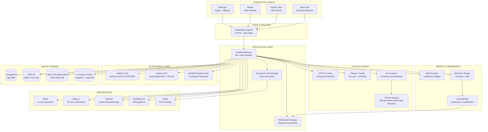
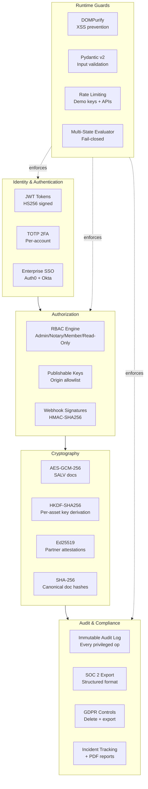
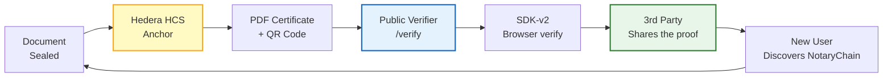

# NotaryChain — Technical Architecture (Single-Page Reference)

> A one-page visual + technical reference for technical investors, CTOs evaluating a partnership, and engineers in due diligence.

---

## 1. System Diagram (High-Level)



---

## 2. The Notarization Pipeline (End-to-End)

The single most important diagram. This is what happens when a customer notarizes a document.

```mermaid
flowchart LR
    A[1. Document<br/>Upload] --> B[2. AI Forgery<br/>Scan<br/>GPT-5 Vision]
    B --> C[3. KBA Quiz<br/>+ Gov-ID<br/>Match]
    C --> D[4. Biometric<br/>Face Capture<br/>+ Liveness]
    D --> E[5. Multi-State<br/>Compliance<br/>Evaluator]
    E --> F[6. Live A/V<br/>Ceremony<br/>Daily.co]
    F --> G[7. Witness<br/>Coordination<br/>Magic-Link]
    G --> H[8. Notary Seal<br/>Application]
    H --> I[9. SHA-256<br/>Canonical<br/>Hash]
    I --> J[10. Hedera HCS<br/>Anchor Mainnet]
    J --> K[11. S3 Object-Lock<br/>10-yr Vault]
    K --> L[12. PDF Cert +<br/>QR Code Issued]
    L --> M[13. Living Identity<br/>Trust Score<br/>Initialized]

    style B fill:#fce4ec,stroke:#c62828
    style C fill:#fce4ec,stroke:#c62828
    style D fill:#fce4ec,stroke:#c62828
    style J fill:#fff9c4,stroke:#f9a825
    style M fill:#e8f5e9,stroke:#2e7d32
```



**Legend:** Pink = AI · Yellow = Blockchain · Green = Continuous trust (post-ceremony)

**Performance characteristics:**
- Steps 1–5 (pre-ceremony): typically 90–180 seconds
- Step 6 (live ceremony): 5–15 minutes
- Steps 7–12 (post-signing): under 30 seconds
- Step 13 onward: lifetime continuous

---

## 3. Tech Stack at a Glance

```
┌─────────────────────────────────────────────────────────────────────┐
│  FRONTEND                                                           │
│  React 18 · React Router v6 · Tailwind CSS · shadcn/ui · recharts   │
│  WebCrypto API (browser-side verifier) · DOMPurify (XSS guard)      │
│  Sentry · PWA-ready · 104 routed pages · lazy-loaded                │
├─────────────────────────────────────────────────────────────────────┤
│  BACKEND                                                            │
│  FastAPI · Python 3.11 · 80+ route modules · 30+ service modules    │
│  Pydantic v2 validation · Motor (async MongoDB) · WebSocket manager │
│  HMAC-SHA256 webhooks · Ed25519 signing · canonical JSON            │
├─────────────────────────────────────────────────────────────────────┤
│  DATA                                                               │
│  MongoDB Atlas (primary) · AWS S3 + Object Lock (immutable docs)    │
│  In-memory cache (analytics, rate-limit) · MongoDB GridFS           │
├─────────────────────────────────────────────────────────────────────┤
│  AI / ML                                                            │
│  OpenAI GPT-5.2 Vision (forgery) · Claude / Gemini (gen/summary)    │
│  Custom training pipeline (planned with Hire 2)                     │
│  Living Identity ML scorer · Threat Learning RL loop                │
├─────────────────────────────────────────────────────────────────────┤
│  BLOCKCHAIN                                                         │
│  Hedera Hashgraph mainnet · HCS topic 0.0.10373605 (live)           │
│  HTS tokens (Trust Badge NFTs, Escrow tokens)                       │
│  Ed25519 keypairs for federated TrustLayer partners                 │
├─────────────────────────────────────────────────────────────────────┤
│  INTEGRATIONS                                                       │
│  Stripe (cs_live_*) · Daily.co (HD A/V) · LexisNexis adapter (KBA)  │
│  Resend (DKIM-verified email.notarychain.app) · GoHighLevel CRM     │
│  Auth0 + Okta SSO · Sentry observability                            │
├─────────────────────────────────────────────────────────────────────┤
│  INFRASTRUCTURE                                                     │
│  Kubernetes cluster · supervisor process manager                    │
│  Hot-reload dev · separated frontend (port 3000) / backend (8001)   │
│  Ingress routing /api → 8001, all else → 3000                       │
└─────────────────────────────────────────────────────────────────────┘
```

---

## 4. Security & Compliance Architecture



**Compliance posture:**
- **SOC 2 Type I:** ready, audit-ready data export live
- **SOC 2 Type II:** target for Q4 of funding period
- **GDPR / CCPA:** user delete + export endpoints live
- **Florida Statute 117.245:** journal compliance verified
- **HIPAA / FERPA:** encryption + audit log architecture supports; vertical-specific certifications future

---

## 5. The Trust Loop (Why Customers Stay)



Every notarization creates a public, verifiable artifact. Every verification is a brand impression. Every successful verification by a third party is **discovery-without-CAC**. This is the engine that turns notarizations into compounding distribution.

---

## 6. Repository Map (for Technical Diligence)

```
/app
├── backend/
│   ├── server.py                          # FastAPI entry, route registration
│   ├── routes/                            # 80+ route modules, grouped by feature
│   │   ├── marketplace_routes.py          # Dynamic pricing quote engine
│   │   ├── compliance_phase2_routes.py    # Multi-state evaluator + snapshots
│   │   ├── fl_compliance_routes.py        # Florida-specific gates
│   │   ├── trustlayer_routes.py           # Federated partner network
│   │   ├── salv_routes.py + salv_phase2   # Encrypted vault + handoffs
│   │   ├── living_identity_routes.py      # Continuous trust scoring
│   │   ├── blockchain_routes.py           # Hedera HCS + HTS
│   │   ├── sdk_routes.py                  # Embeddable SDK + webhooks
│   │   └── ... (75 more)
│   ├── services/                          # 30+ service modules
│   │   ├── analytics_service.py           # Admin dashboard builders
│   │   ├── hedera_service.py              # HCS + HTS clients
│   │   ├── living_identity_service.py     # Drift detection + scoring
│   │   ├── salv_service.py                # AES-GCM-256 encryption
│   │   ├── multistate_evaluator.py        # Compliance fail-closed
│   │   ├── ai_document_intelligence.py    # GPT-5 Vision pipeline
│   │   ├── trustlayer_crypto.py           # Ed25519 + canonical JSON
│   │   └── ... (23 more)
│   ├── models_notary.py                   # Core Pydantic models
│   └── tests/                             # pytest suites
│       ├── test_marketplace_pricing.py    # 45 tests, all green
│       ├── test_compliance_snapshot.py
│       └── test_pickability_index.py
│
├── frontend/
│   ├── src/
│   │   ├── App.js                         # Routing (lazy-loaded, 109 routes)
│   │   ├── lazyRoutes.js                  # Code-split route components
│   │   ├── pages/                         # 104 routed pages
│   │   ├── components/
│   │   │   ├── admin/tabs/                # 7 admin dashboard tab components
│   │   │   ├── ui/                        # shadcn/ui primitives
│   │   │   ├── DashboardHero.jsx          # Role-aware KPI panel
│   │   │   ├── PlatformFooter.jsx
│   │   │   └── GlobalSubheader.jsx
│   │   ├── contexts/                      # Auth + Theme contexts
│   │   └── lib/                           # Utilities + API client
│   └── package.json
│
├── memory/
│   ├── PRD.md                             # Product requirements (canonical)
│   ├── CHANGELOG.md                       # Implementation log
│   └── test_credentials.md                # Test account credentials
│
├── FUNDING_PROPOSAL.md                    # 17-section investor proposal
├── FEATURE_CATALOG.md                     # 106 features × 12 domains
├── ELEVATOR_PITCH.md                      # 90-second scripts × 3 audiences
├── ARCHITECTURE.md                        # This file
├── DEMO_SCRIPT.md                         # Live demo walk-through
└── USER_GUIDE.md                          # In-app documentation source
```

---

## 7. Key Architectural Decisions (and Why)

| Decision | Why we chose this | What we rejected |
|---|---|---|
| **Hedera over Ethereum / Solana** | Sub-cent transactions, enterprise governance council (Boeing, Google, IBM, LG), aBFT consensus, predictable cost. | Ethereum L1 ($5–20/tx untenable for notarization volume), Solana (centralization concerns). |
| **MongoDB over Postgres** | Document-shaped data (ceremonies, journals, audit logs) fits naturally. Schema evolution is constant in early-stage. | Postgres (would have required heavy JSONB use). |
| **FastAPI over Django / Node** | Pydantic validation is best-in-class for API correctness. Async-first matches our event-driven workload (Hedera, webhooks, AI). | Django (sync model fights our use case), Node (less rigorous validation ecosystem). |
| **AES-GCM-256 with HKDF per-asset key** | Per-asset key derivation means compromise of one asset never compromises others. NIST-recommended. | Single master key encryption (fragile), client-side-only encryption (key management UX nightmare). |
| **Ed25519 over RSA / secp256k1** | Smaller signatures, deterministic, fast verification, no nonce-reuse risk. | RSA (huge keys), secp256k1 (Ethereum-native but no advantage here). |
| **Canonical JSON for signing** | Eliminates a major class of "the JSON serializer changed and now signatures don't verify" bugs. | Signing raw user-input JSON (will break inevitably). |
| **Multi-state evaluator fail-closed** | An unhandled exception aborts the seal rather than silently letting it through. Regulatory survival. | Fail-open (would eventually result in an unauthorized seal — license risk). |
| **Public verifier with no auth** | Anyone in the world can verify any seal without contacting us. Turns us into infrastructure, not a gatekeeper. | Auth-gated verifier (would centralize trust on us — defeats the architecture). |
| **Lazy-loaded React routes** | 104 pages would mean a 2MB+ initial bundle. Lazy splitting keeps first-paint under 300KB. | Single bundle (poor mobile experience). |

---

## 8. The Defensibility Stack (Why Replicating This Takes 24+ Months)

A competitor wanting to match NotaryChain would need to simultaneously execute:

1. **Hedera mainnet integration** — including HBAR treasury management, HCS topic provisioning, HTS NFT minting, and partner Ed25519 key infrastructure. *Realistic: 6 months for an experienced blockchain team.*

2. **Multi-state RON compliance** — researching, encoding, and shipping fail-closed evaluators for at least 5 state statutes. *Realistic: 4 months with regulatory counsel.*

3. **AI forensics pipeline** — wiring GPT-5 Vision (or equivalent), training custom forgery models, building the AI Conductor orchestration, and integrating it pre-seal. *Realistic: 6 months with experienced ML.*

4. **Living Identity engine** — biometric capture, liveness, drift detection, behavioral scoring, WebSocket real-time alerts. *Realistic: 5 months.*

5. **Federated TrustLayer** — Ed25519 partner key infrastructure, canonical-JSON signing, public attestation verifier, multi-chain SDK. *Realistic: 4 months.*

6. **Florida RONSP filing** — application, approval, ongoing compliance. *Realistic: 3–6 months calendar time regardless of engineering speed.*

7. **9 monetization surfaces** — Trust Badge widget with DNS verification + HTS NFT, embeddable SDK + iframe, marketplace + dynamic pricing + reviews, tokenized escrow templates, subscription tiers, etc. *Realistic: 6 months.*

The non-engineering items (RONSP, regulatory mapping, partner key onboarding) make this **calendar-bound, not engineer-bound** — you can't simply throw more engineers at it.

**Even with a $20M Series A and a 30-engineer team, a competitor is 18 months behind us. With a $5M seed and a 6-engineer team, they're 24+ months behind.**

---

*Last updated: February 2026. Source of truth for all engineering decisions and external technical claims.*
